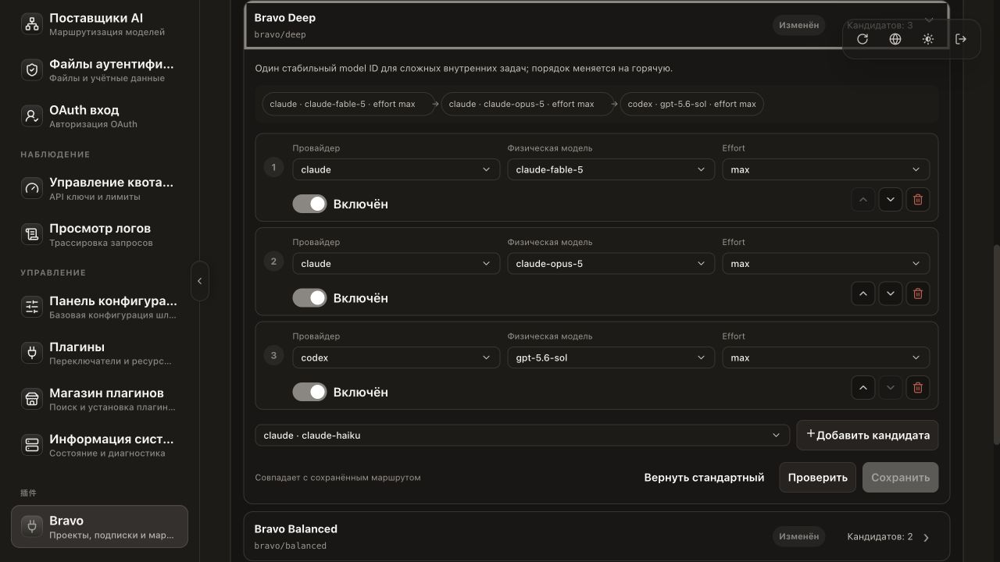
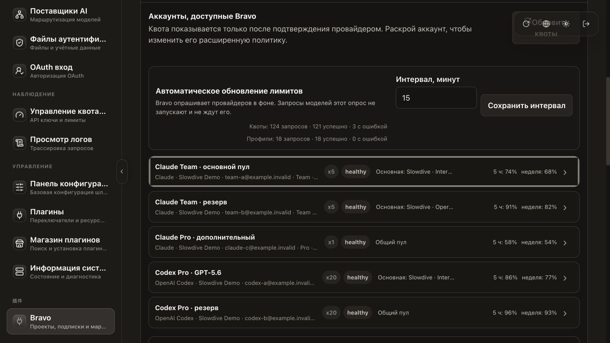

# Bravo

### Проектный AI-шлюз поверх Claude, Codex и других CLI-подписок

**Bravo разрабатывается компанией Slowdive. Создатель — Никита Усков.** Это
самостоятельно поддерживаемый форк
[CLIProxyAPI](https://github.com/router-for-me/CLIProxyAPI), а не официальный
репозиторий CLIProxyAPI. Bravo добавляет проектные ключи, логические модели,
контролируемый fallback между провайдерами, русские диагностические ошибки,
аналитику и управление подписками из одной админки.

> База зафиксирована: [CLIProxyAPI v7.2.94](https://github.com/router-for-me/CLIProxyAPI/tree/v7.2.94),
> точный upstream commit
> [`36b45d57`](https://github.com/router-for-me/CLIProxyAPI/commit/36b45d57a3e804b9dfcee307e5d7b3e8cea5acfc).
> Upstream не подтягивается в Bravo автоматически.

> **Один проектный ключ. Два стандартных API. Несколько подписок.**
> Claude Code, внутренний мини-проект, корпоративный бот и production-сервис
> могут обращаться к одному и тому же Bravo через привычный Anthropic или
> OpenAI контракт.

## Главное: ваши модели, ваш пул и маршруты на горячую

Клиенту выдаётся один проектный ключ `brv_...` и стабильное имя собственной
логической модели Bravo — например `bravo/deep`. Клиенту не нужно знать, какая
физическая модель и какая подписка обслужат следующий запрос. За одним именем
может стоять весь разрешённый пул проекта и такая последовательность:

```text
project key + bravo/deep
          │
          ├─ 1. Claude Fable 5  → все подходящие Claude-подписки проекта
          ├─ 2. Claude Opus 5   → все подходящие Claude-подписки проекта
          └─ 3. Codex GPT-5.6   → все подходящие Codex-подписки проекта
```

**Порядок можно поменять в любой момент во встроенной админке.** Изменение
начинает действовать на горячую для всех проектов, которым разрешена эта
логическая модель. Не нужно перевыпускать ключи, менять настройки Claude Code,
просить коллег обновить model ID или заново разворачивать их приложения.

Bravo сначала перебирает подходящие подписки для текущего физического
кандидата, а затем переходит к следующей совместимой модели/provider до первого
видимого ответа клиенту. Если Fable временно недоступен, тот же запрос
`bravo/deep` может продолжиться через Opus, а затем через GPT-5.6.

Bravo не вводит продуктового ограничения на число подключённых подписок в
проектном пуле: можно подключить столько Claude и Codex-аккаунтов, сколько
обслуживает ваша установка. Режим **«весь пул»** автоматически включает текущие
и будущие подписки; явный список нужен, когда требуется изоляция команд или
проектов. Реальные квоты, rate limits, правила провайдеров и ресурсы сервера,
разумеется, продолжают действовать.



*Маршрут демонстрационный; порядок кандидатов меняется и сохраняется прямо во
встроенной админке CLIProxyAPI.*

## Рекомендуемый запуск в компании

1. Откройте в обычной админке CLIProxyAPI раздел подключения подписок
   (**Файлы аутентификации / Подписки**).
2. Создайте отдельную ссылку подключения для каждого сотрудника и отправьте её
   только ему. Сотрудник проходит вход в Claude или Codex своей подпиской.
3. После появления аккаунта добавьте понятный комментарий: имя сотрудника,
   команда и назначение подписки. Позже так значительно проще разбирать пул,
   квоты и фактические маршруты.
4. Откройте **Bravo → Совместимость моделей**, проверьте поддерживаемые
   контракты, затем откройте **Маршруты логических моделей** и при необходимости
   поменяйте порядок Fable, Opus, GPT-5.6 и других кандидатов.
5. Только после этого нажмите **Создать проект**: выберите весь пул или явный
   список подписок, primary-аккаунты, доступные `bravo/*` модели и кэширование.
6. Сохраните показанный один раз ключ `brv_...`, передайте проекту base URL и
   ключ и приступайте к работе. Для каждого приложения или команды лучше
   выпускать собственный проектный ключ, а не делить один общий.



*На скриншоте только демонстрационные аккаунты. Комментарии, ownership и
тарифы позволяют быстро понять, чья подписка находится в общем пуле.*

## Текущий статус

| Линия | Статус | Что это |
| --- | --- | --- |
| **Bravo 0.9.0-preview.12** | current preview | Preview.11 плюс безопасный production-режим `breaker`: маршрут временно закрывается только после реальной проверенной quota/rate-limit ошибки, прогноз остаётся shadow-only, а локальное adaptive-решение никогда не выдаётся клиенту. После обычных соседей Bravo допускает не более одного глобального single-flight recovery probe на поколение breaker, если не исчерпан операторский `max_attempts`; остальные запросы не ждут и не спамят подписку. Строгий порядок «своя primary → общий пул», общий ограниченный HTTP/2 transport pool и error-only `metadata` сохранены. |
| **Bravo 0.9.0-preview.8** | edge-gate shadow | `preview.7` плюс упрощённый автомат Green / Guarded / Tripped / Half-open. Он не пытается угадать расход конкретного запроса: у края квоты моделирует один запрос в полёте, после реальной quota/rate-limit ошибки — breaker и ровно один probe. В этой версии результат только пишется в аудит: маршруты, задержки и число обращений к подпискам не меняются. |
| **Bravo 0.9.0-preview.7** | structured-output compatibility | `preview.6` плюс live-verified Anthropic `output_config.format` для служебных Claude Code-вызовов: Claude Haiku получает нативную JSON Schema, а Codex Luna — эквивалентный Responses `text.format`. Контракт остаётся fail-closed для неизвестных форматов и не подменяет строгий JSON обычной текстовой инструкцией. |
| **Bravo 0.9.0-preview.6** | forecast backtest shadow | Безопасная 0.8.11 плюс адаптивный сбор. Оценка связывает реальные usage-токены с подтверждённым падением каждого session/weekly/model-weekly окна, а backtest сравнивает сохранённый до запроса прогноз со следующим подтверждённым фактом и показывает bias, MAE, p95 и максимум недопрогноза. Режим только наблюдает: он не блокирует запросы, не меняет порядок маршрутов и не создаёт дополнительных обращений к провайдерам. |
| **Bravo 0.8.11** | stable rollback | Безопасная стабильная линия: все исправления 0.8.10 плюс проектные API лимитов и прозрачных маршрутов. Новый адаптивный allocator сюда намеренно не входит. |
| **Bravo 0.8.10** | previous stable | Предыдущий стабильный снимок: [`59fc4f02`](https://github.com/nikitau-svg/CLIProxyAPI/commit/59fc4f0260831a192aac782cdea3950d91d0d4d6). |
| **CLIProxyAPI v7.2.94** | pinned upstream | Точная внешняя основа, от которой ведётся Bravo. |

Публичный канал Bravo — **`bravo/main`**; сейчас он ведёт на preview.12.
Безопасной стабильной точкой отката остаётся **0.8.11**. Ветка `main`
сохраняется как историческая копия upstream и не является актуальной точкой
входа в Bravo. Полная политика веток и обновлений описана в
[`docs/BRAVO_PROJECT_RU.md`](docs/BRAVO_PROJECT_RU.md).

### Что именно добавляет preview.12

«Подписочный коммунизм» остаётся общим пулом без искусственного лимита агентов
на проект, но сохраняет владение: проект сначала использует свои primary-
подписки, а после их подтверждённого исчерпания или недоступности продолжает
маршрут через разрешённый общий пул. Вторичный проект может занимать только
ёмкость выше резервного порога владельца; владелец может расходовать свой
резерв до подтверждённого нуля. Обычный fallback не обходит отключение,
известное исчерпание или резервный порог. Специальный `/compact` остаётся
отдельным, ограниченным по частоте аварийным исключением и требует
подтверждённого положительного остатка.

Если подтверждённый ноль относится к уже наступившему плановому сбросу, но
фоновый снимок ещё не обновился, Bravo разрешает ровно один неблокирующий
probe на подписку и поколение сброса. Даже при сотне одновременных агентов
остальные сразу продолжают соседний маршрут и не создают залп к провайдеру.
После фактической отправки поколение считается проверенным до нового
подтверждённого снимка или следующего сброса.

Для частых параллельных вызовов соединения теперь переиспользуются в общем
ограниченном пуле, разделённом по подписке, provider и egress/proxy. До 256
неактивных transport-identity хранятся десять минут, простаивающее HTTP/2-
соединение — до 90 секунд. Активное соединение не вытесняется, а всплеск не
попадает в скрытую межпроектную очередь; данные авторизации и HTTP/2 state не
пересекают границу identity.

При выключенном полном `request-log` новый безопасный режим сохраняет только
служебную диагностику: method/path, замаскированные headers, размеры,
HTTP-статус и очищенные машинные поля ошибки:

```yaml
error-log-capture:
  mode: metadata # default; use off to disable forced error files
```

`metadata` не удерживает и не пишет тела запроса, ответа или upstream-ответа.
`off` полностью отключает такие forced error-файлы; режим `body` намеренно
отклоняется конфигурацией.

### Безопасный rollout preview.12

Миграция базы, auth-файлов или `bravo-state.json` не требуется: существующие
конфигурация и аналитика продолжают загружаться, а transport/edge-gate runtime
пересоздаётся в памяти. Перед заменой контейнера всё равно сохраните предыдущий
образ, `config.yaml` и state-файл — это обычная страховка отката, а не шаг
миграции.

1. Для canary оставьте `adaptive_allocator_mode: observe`: порядок попыток и
   число provider-вызовов будут прежними, но аудит продолжит собираться.
2. После smoke-проверки включите `breaker`. Он закрывает auth/model только после
   реальной проверенной quota/rate-limit ошибки и сразу продолжает уже
   настроенный соседний маршрут. Прогноз расхода остаётся теневым. Если соседи
   не ответили и не исчерпан настроенный `max_attempts`, один исходный кандидат
   может выполнить глобальный single-flight recovery probe. На одно поколение
   breaker реально уйдёт не более одного такого вызова; конкуренты не ждут. В
   streaming-маршруте этот proof выполняется только последовательно в хвосте и
   никогда не запускается как hedge. При насыщении координации защищённый
   scheduled/recovery proof пропускается локально, а не уходит fail-open к
   провайдеру. В
   любом случае `bravo_adaptive_*` не становится клиентской ошибкой; реальный
   отказ соседей может дать обычную общую 503.
3. Проверьте `/v0/management/bravo/adaptive-audit`: отсутствие очередей и
   дополнительных provider-вызовов, число применённых пропусков и реальные
   quota outcomes. При сомнении верните `observe` без отката образа. Полный
   прогнозный `enforce` остаётся экспериментальным и не является prod-default.
4. Полный аварийный откат — прежний образ 0.8.11 с сохранёнными auth/config и
   сделанной перед rollout копией state.

## Что даёт Bravo

- один проектный ключ `brv_...` для Anthropic- и OpenAI-совместимых клиентов;
- логические модели `bravo/opus`, `bravo/sonnet`, `bravo/terra` и другие;
- явный пул подписок и allowlist моделей для каждого проекта;
- порядок «primary проекта → защищённый общий пул» без фиксированного лимита
  параллельных агентов проекта;
- fallback между совместимыми Claude и Codex-моделями до первого видимого
  ответа клиенту;
- ограниченное переиспользование изолированных HTTP/2-соединений без скрытой
  межпроектной очереди;
- мультимодальный ввод PNG/JPEG, tool use и OpenAI JSON mode;
- безопасную нормализацию несовместимых параметров разных провайдеров;
- русские клиентские ошибки и route trace без раскрытия ключей и OAuth-данных;
- управление проектами, маршрутами, квотами и аналитикой в обычной встроенной
  админке CLIProxyAPI.

## Не только Claude Code

Bravo можно использовать для небольших внутренних проектов компании:
прототипов, cron-задач, автоматизаций, корпоративных ботов и агентных систем —
практически для любого приложения, которое умеет работать с OpenAI- или
Anthropic-совместимым API.

Не обязательно принимать конкретный agent framework. Можно использовать
OpenAI Agents SDK, Anthropic SDK, LangChain, OpenClaw, собственный HTTP-клиент
или вообще небольшой скрипт: достаточно заменить `base_url`, выдать проектный
ключ и выбрать `bravo/*` модель. Bravo является транспортным и policy-слоем;
агентная логика, tools и память остаются в выбранном приложении.

OpenAI-совместимый проект:

```bash
export OPENAI_BASE_URL='http://<server>:8317/v1'
export OPENAI_API_KEY='<project-key-brv_...>'
```

Anthropic-совместимый проект:

```bash
export ANTHROPIC_BASE_URL='http://<server>:8317'
export ANTHROPIC_API_KEY='<project-key-brv_...>'
```

Это особенно удобно перед прямыми API-расходами: проект можно запускать и
отлаживать на уже разрешённых CLI-подписках, видеть его отдельную аналитику и
только затем решать, нужен ли ему платный API-канал. Подходящие проекты можно
оставлять на подписочном пуле и дальше. Это не обещание бесплатного или
безлимитного inference: действуют реальные квоты, rate limits и условия
подключённых провайдеров.

Если capability нельзя безопасно перенести между Claude и Codex, Bravo не
притворяется, что всё совместимо: маршрут завершается понятной fail-closed
ошибкой до искажения запроса. Благодаря этому прототип можно постепенно
доводить до production, не меняя внешний API-контракт вслепую.

## Кэширование промптов

Prompt caching настраивается отдельно для каждого проекта в той же встроенной
админке CLIProxyAPI:

- Claude: `auto`, `5m` или `1h`; Bravo переносит настройку в нативный запрос
  после выбора физического кандидата;
- OpenAI/Codex: provider-managed caching; поддерживаемая cache identity
  изолируется проектом;
- retries на той же паре provider/account могут повторно использовать точный
  подходящий prefix;
- переход на другой аккаунт или provider может закономерно дать cache miss;
- Bravo не хранит тексты промптов и ответы модели в своей аналитике.

Кэш снижает повторный ввод и задержку на длинных стабильных префиксах, но не
меняет ответ и не скрывает обычный запрос при cache miss.

## Почему полноценный fork — преимущество

Bravo нельзя было надёжно собрать как случайный набор runtime-патчей поверх
плавающего upstream. Маршрутизация затрагивает ядро, host callbacks, streaming,
перевод OpenAI ↔ Anthropic, tool use, vision, JSON mode, prompt caching и
сохранность ошибок до клиента. Полноценный fork даёт:

1. **Воспроизводимость.** Видны точные upstream tag/commit и commit каждой
   версии Bravo.
2. **Сквозные гарантии.** Изменение можно проверить от входного HTTP-запроса до
   конкретного provider/account, включая retry и первый stream payload.
3. **Безопасный stable.** Рабочая 0.8.11 остаётся отдельной точкой отката, а
   адаптивный allocator развивается в явно обозначенной preview-линии.
4. **Нормальный откат.** Код, документация и миграции state зафиксированы
   вместе, а не разбросаны по локальным файлам сервера.
5. **Проверяемую связь с upstream.** Сохраняются история, MIT-атрибуция и
   возможность выборочно переносить изменения CLIProxyAPI без автоматического
   изменения production-поведения.
6. **Собственный продуктовый контракт Slowdive.** Проектные ключи, русские
   ошибки, изоляция пулов, аналитика и интерфейс развиваются как единая система.

## Быстрый старт

### 1. Установите сервер

Для чистой установки используйте пошаговую инструкцию
[`AWS_INSTALL_RU.md`](AWS_INSTALL_RU.md). Если инстанс уже развёрнут, откройте:

```text
http://<server>:8317/management.html
```

Это обычная встроенная админка CLIProxyAPI, а не отдельный сервис или второй
сайт. В ней выберите **Bravo → Создать проект**, задайте разрешённые модели и
подписки, затем сохраните показанный один раз ключ `brv_...`.

### 2. Подключите Claude Code

Для Claude Code рекомендуется версия `2.1.223` или новее и следующий профиль
в `~/.claude/settings.json`. Если файл уже существует, добавьте поля в его
текущий объект `env`, а не перезаписывайте остальные настройки:

```json
{
  "env": {
    "CLAUDE_CODE_EXPERIMENTAL_AGENT_TEAMS": "1",
    "CLAUDE_CODE_DISABLE_UNKNOWN_MODEL_WINDOW_ENFORCEMENT": "1",
    "CLAUDE_CODE_MAX_CONTEXT_TOKENS": "1000000",
    "CLAUDE_CODE_AUTO_COMPACT_WINDOW": "700000",
    "CLAUDE_CODE_ALWAYS_ENABLE_EFFORT": "1",
    "ENABLE_TOOL_SEARCH": "true",
    "ANTHROPIC_BASE_URL": "http://<server>:8317",
    "ANTHROPIC_AUTH_TOKEN": "<project-key-brv_...>",
    "ANTHROPIC_DEFAULT_FABLE_MODEL": "bravo/fable",
    "ANTHROPIC_DEFAULT_OPUS_MODEL": "bravo/opus",
    "ANTHROPIC_DEFAULT_SONNET_MODEL": "bravo/sonnet",
    "ANTHROPIC_DEFAULT_HAIKU_MODEL": "bravo/haiku",
    "CLAUDE_CODE_SUBAGENT_MODEL": "bravo/opus",
    "ANTHROPIC_MODEL": "bravo/opus",
    "CLAUDE_CODE_EFFORT_LEVEL": "max"
  }
}
```

После сохранения перезапустите Claude Code и проверьте `claude --version`,
`/model`, `/effort` и `/status`. Профиль настроен на максимальное качество:
главная сессия и subagents используют `bravo/opus` с effort `max`, поэтому он
быстрее расходует лимиты. Для более экономной командной работы замените эти
два значения на `bravo/sonnet` или `bravo/terra`.

Окно auto-compact выставлено на 700K при заявленном окне 1M. Это защищает
длинные сессии, но не делает context window физической fallback-модели больше:
если конкретный кандидат меньше текущей истории, Bravo честно вернёт ошибку
контекста и предложит `/compact`.

Полная инструкция и готовый пакет для коллег:
[`CLAUDE_CODE_BRAVO_RU.md`](CLAUDE_CODE_BRAVO_RU.md).

### 3. Подключите OpenAI-совместимый клиент

```text
Base URL: http://<server>:8317/v1
API key:  <тот же project-key-brv_...>
Model:    bravo/terra
```

Один и тот же проектный ключ работает через Anthropic Messages, OpenAI Chat
Completions и OpenAI Responses. Полное объяснение ключей, пулов и встроенных
маршрутов: [`BRAVO_MODELS_AND_KEYS_RU.md`](BRAVO_MODELS_AND_KEYS_RU.md).

### 4. Лимиты и прозрачные маршруты проекта

Начиная с Bravo **0.8.11**, ключ проекта получает две read-only ручки:

```bash
curl --fail-with-body -sS "${ANTHROPIC_BASE_URL%/}/v1/bravo/limits?format=text" \
  -H "Authorization: Bearer ${ANTHROPIC_AUTH_TOKEN}"

curl --fail-with-body -sS "${ANTHROPIC_BASE_URL%/}/v1/bravo/routes" \
  -H "Authorization: Bearer ${ANTHROPIC_AUTH_TOKEN}"
```

`limits` показывает доступность Claude/Codex, окна и время сброса, а JSON-вид
дополнительно содержит usage проекта за 30 дней. Результат обновляется не чаще
одного раза в 5 минут на проект; повторные вызовы всегда получают сохранённый
снимок с HTTP 200, а не ошибку. `routes` объясняет, какие физические модели
стоят за разрешёнными этому ключу `bravo/*`, их порядок и capabilities.

Эти команды можно отдавать коллегам вместе с **их собственным** проектным
ключом: так каждый строит свой CLI и агентов по фактическим возможностям пула,
не получая доступ к чужим проектам или OAuth-аккаунтам. Сам `brv_...` остаётся
секретом — не вставляйте его прямо в общие инструкции или чаты.

Обе ручки входят в stable 0.8.11. Они читают только локально сохранённый снимок
Bravo и не выполняют provider-запрос при вызове.

## Документация

| Задача | Документ |
| --- | --- |
| Понять, что даёт fork, на чём он основан и какие ветки использовать | [`docs/BRAVO_PROJECT_RU.md`](docs/BRAVO_PROJECT_RU.md) |
| Установить чистый сервер | [`AWS_INSTALL_RU.md`](AWS_INSTALL_RU.md) |
| Настроить Claude Code, agent teams, прямую проверку лимитов без модели и командный onboarding | [`CLAUDE_CODE_BRAVO_RU.md`](CLAUDE_CODE_BRAVO_RU.md) |
| Создать проектный ключ и настроить модели/fallback | [`BRAVO_MODELS_AND_KEYS_RU.md`](BRAVO_MODELS_AND_KEYS_RU.md) |
| Понять устройство плагина Bravo | [`plugins/bravo/README.md`](plugins/bravo/README.md) |
| Внести изменение или оформить баг | [`CONTRIBUTING.md`](CONTRIBUTING.md) |
| Посмотреть оригинальный проект именно той версии, от которой сделан форк | [CLIProxyAPI v7.2.94](https://github.com/router-for-me/CLIProxyAPI/tree/v7.2.94) |

Исходники интерфейса развиваются в отдельном репозитории
[Cli-Proxy-API-Management-Center](https://github.com/nikitau-svg/Cli-Proxy-API-Management-Center/tree/feat/bravo-quota-polling-ui),
но пользователю не нужно открывать или устанавливать вторую админку: её сборка
встраивается в обычный `/management.html` этого сервера.

## Структура репозитория

- `plugins/bravo/` — маршрутизация, проектные ключи, квоты, диагностика и
  management API Bravo;
- `internal/`, `sdk/`, `cmd/` — зафиксированное ядро CLIProxyAPI и необходимые
  изменения интеграции;
- `deploy/`, `docker-compose*.yml` — контейнерное развёртывание;
- `scripts/`, `test/` и `*_TEST_PLAN.md` — проверки релизных контрактов;
- `BRAVO_*_RU.md` — операторская документация на русском языке.

## Происхождение и лицензия

Bravo распространяется по лицензии [MIT](LICENSE) и сохраняет атрибуцию
оригинального CLIProxyAPI. Связь GitHub fork с upstream также сохранена на
уровне самого репозитория.

Изменения Bravo поддерживаются в
[`nikitau-svg/CLIProxyAPI`](https://github.com/nikitau-svg/CLIProxyAPI).
Ошибки оригинального ядра, воспроизводимые на чистом upstream v7.2.94 без
Bravo, следует сверять с
[`router-for-me/CLIProxyAPI`](https://github.com/router-for-me/CLIProxyAPI).
